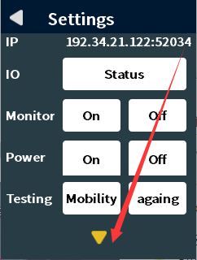

# Mercury Panel User Guide

## 1 Mercury Panel Introduction

Mercury Panel is an application that controls the Mercury robot arm by touching the cm4 on the base of the robot arm. Its functions are coordinate control, Angle control, drag teaching, etc.), which is convenient for operators to interact with elephant robots and correctly use elephant robots.

Applicable equipment:

-Mercury A1

**Be sure to download the updated atom and basic firmware before use**

## 2 How to use it

After ensuring that your machine has been configured with the panel to start, run the panel when it starts. When the panel is run, the user can intuitively see the button that can be clicked and the corresponding comment. The default startup is the power-on state (the rbg light at the end of the power-on state will be on). The gray triangle in the upper left corner of the interface is to return to the previous interface, and the x in the upper right corner is to close the interface.

### 2.1 Drag & Play
Click drag to teach in the main interface to enter the drag to teach interface.

Enter the drag teaching interface and relax the mechanical arm as a whole, and move to the teaching starting point.

Click to start recording, the recording time will be displayed on the top in real time when recording (the recording time shall not exceed 60 seconds, otherwise there will be a pop-up warning, you need to exit the drag teaching interface and re-enter), drag the recording point of the mechanical arm, click to end recording, the mechanical arm will be locked, and the recording will be completed.

Click to pause the recording process, and then lock the mechanical arm as a whole. Click to continue recording.

Click Single execution to play a recorded action; Click Continue to play the recording action in a loop. Click Stop to stop playing after executing the current action.

### 2.2 Motion control

Click "Quick Move" in the main interface to enter the "Quick Move" interface and select Angle control or coordinate control.

Angle control: Select the joint to be operated, and the control is divided into continuous motion and stepping motion. Select continuous under run, this is continuous movement, after pressing the button, until the release button will stop (after reaching the limit will also stop); Select 1 mm/degree or 5 mm/degree (step value) under run, then it is a step movement, click + to increase the corresponding step value, click - to reduce the corresponding step value, the step movement will stop when it reaches the point (for example, joint 1 is at an Angle of 30 with an incremental value of 50, press the button on the side of the minus sign, then the robot arm will stop when it moves to -20).

Coordinate control: Adjust the robot arm to a proper attitude, such as joint 4: -90°, before performing coordinate control. Select the axis to operate, the control is divided into continuous motion and step motion. Select continuous under run, this is continuous movement, after pressing the button, until the release button will stop (after reaching the limit will also stop); Select 1 mm/degree or 5 mm/degree (step value) under run, then it is a step movement, click + to increase the corresponding step value, click - to reduce the corresponding step value, the step movement will stop when it reaches the point (for example, the X-axis is now 30, the incremental value is 50, press the button on the side of the plus sign, then the robot arm will stop when it moves to 80). RA is the redundant arm Angle.

Free movement: Press the free movement button to enter the free movement mode, and the rgb light of atom changes color. Keep pressing the rgb button at the end of the robot arm to relax, and the whole robot arm can move freely and release the whole lock of the rgb button at the end. Click Free Move again to exit Free Move mode.

### 2.3 Overall operating state

Click the motor status on the main interface to enter the motor status interface and check the motor connection status. The whole mechanical arm can be relaxed and locked by all locking and all relaxing.

Click Settings on the main screen to enter the Settings screen.

On this screen you can click IO status to view the IO status corresponding to atom and basic.

IO status interface setting pin high and low level has not been developed.

The monitor mode is not yet developed.

Click Power -> On, power on, wait 7s for the power-on process; Click Power -> Power Off, power off, power off process wait 3 seconds.

Click quick test -> Multi-motion, the robot arm starts a round of multi-point movement; Click Quick Test -> Aging, the robot arm starts to cycle a set of large point movements, click aging again, and the robot arm stops after completing the current round of action.

Click the yellow triangle and turn the page.

Tap Language to enter the language Settings screen, you can select the theme language of the application.

Tap the serial port to go to the serial port control screen. Click serial port connection -> Open to open the serial port; Serial port connection -> Off, close the serial port.

Click Calibrate to enter the calibration screen. You can perform a psychic calibration for each motor: click on the corresponding joint of the power off to relax the mechanical arm, drag the corresponding joint to the new zero position, click on the corresponding joint lock, and the calibration is completed.

The Log interface is not developed yet.

Click About to enter the About screen to view the application version.

